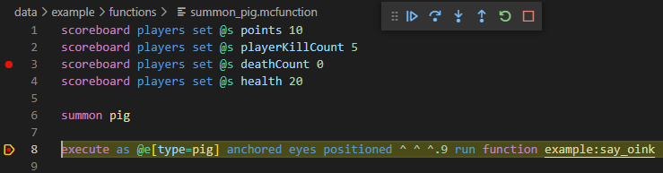
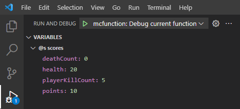
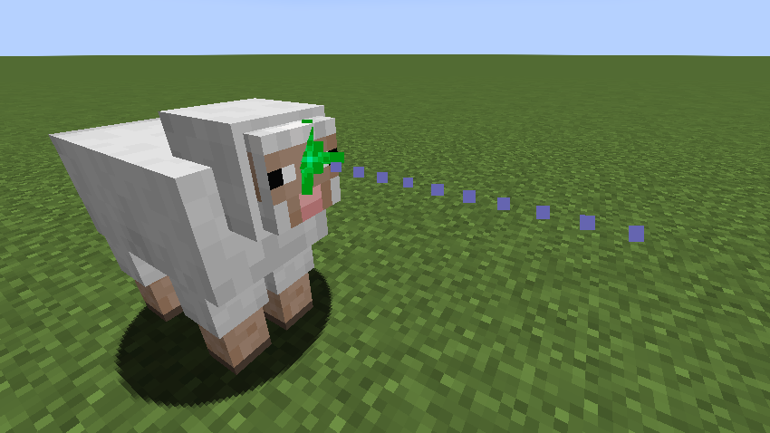

This repository has moved to https://codeberg.org/vanilla-technologies/mcfunction-debugger-vscode to avoid GitHubs two factor authentication (2FA) requirement. We believe that Microsofts decision to force all code contributors to use 2FA is very problematic for the following reasons:

1. 2FA significantly increases the risk of irreversible account loss. This is very different to 2FA for something like online banking where in the worst case you can contact your bank and verify your identity to regain access. With GitHub however, if you loose your phone and backup codes (both of which is possible), you will never gain access to your account again.
2. The decision to require 2FA for every code contributor seems very needless. Yes software supply chain attacks are a thing, but not every code contributor on GitHub is responsible for widely used libraries. It's quite the opposite: most code contributors are not responsible for widely used libraries and their code is reviewed and merged by those that are. Also, the details of the 2FA requirement seem arbitrary. Why for example is email not accepted as a second factor or why can WebAuth only be a second second factor and not a primary second factor? Just to make it really hard to not use a phone for 2FA? It feels like a "trust us, we know what's good for you" attitude from Microsoft and it is scary to think what arbitrary decision could come next.
3. Depending on how you use passwords the account security is not necessary improved that much by using 2FA, especially if it is forced onto people that don't want to use it. So why is there no opt out?
4. Many other developers publicly stated that they are leaving GitHub because of this, so staying on GitHub would prevent any code contributions from these people. This makes finding good contributors even harder than before. By moving to https://codeberg.org everyone can continue to contribute to this project.
5. Unfortunately Microsoft does not allow mail as a second factor and some companies do not allow you to bring your private phone to work or install proprietary software (such authenticators) for security reasons. This means 2FA can actually completely prevent you from logging into the website in some circumstances. This is really sad, because it can make it harder for professional developers at companies that use free and open source software to return something to the community.
6. Not everyone owns/can afford a smartphone or dedicated authenticator hardware and Microsoft makes it very inconvenient to use 2FA without that by requiring you to install authenticator software on every development machine. This discourages code contributions from poor people.

2FA is a good technology, but it should be up to repository owners to decide whether it is appropriate for the project at hand. Requiring 2FA for all code contributions, even for code that is reviewed and merged by other people, is completely unnecessary and discourages contributions.

[](https://www.minecraft.net/store/minecraft-java-edition)
\
[](https://marketplace.visualstudio.com/items?itemName=vanilla-technologies.mcfunction-debugger)
[](https://github.com/vanilla-technologies/mcfunction-debugger-vscode/blob/master/LICENSE)

# McFunction-Debugger

McFunction-Debugger is a debugger for Minecraft's mcfunction files that does not require any Minecraft mods.

## Features

### Execute mcfunction Files

You can execute any mcfunction file of a datapack in your Minecraft world directly from Visual Studio Code.

The function will be executed with a `schedule` command, so it runs without an `@s` entity at the world's origin position.
To change this, you can create a new function that executes your function as the player or at a different position and debug this new function instead. For example:

```mcfunction
execute as @p at @s run function my_namespace:my_function
```

### Breakpoints

Pause the execution at any point by setting breakpoints.



_Syntax highlighting in this screenshot was provided by [Data-pack Helper Plus](https://github.com/SpyglassMC/vscode-datapack)._

### Step through your Program

Starting from a breakpoint you can execute your program line by line.

### View Scores

The scores of the `@s` entity are displayed when the execution is paused.



### View Position and Rotation in Minecraft

When paused, the current position and rotation are displayed with particles in Minecraft.



You can teleport yourself to this position and rotation by executing the following command:
```mcfunction
teleport @s @e[type=area_effect_cloud,tag=mcfd_breakpoint,limit=1]
```

## Quick Start

1. Install McFunction-Debugger from Visual Studio Code Marketplace.
2. Go to "Run and Debug":
  * Windows / Linux: `Ctrl + Shift + D`
  * macOS: `Cmd + Shift + D`
3. Click on "create a launch.json file".
4. Adjust the value of `minecraftWorldDir` to point to your Minecraft world.
5. Open that world in Minecraft.
6. Open the mcfunction file you want to debug (it must be in a datapack with a `pack.mcmeta` file).
7. Set a breakpoint at a line with a Minecraft command by clicking left to the line number.
8. Press the key `F5` on your keyboard.
9. Execute the command `/reload` in Minecraft and follow the instructions there.

## Uninstall

To connect to Minecraft McFunction-Debugger uses [Minect](https://github.com/vanilla-technologies/minect) to create a connection building in Minecraft the first time you debug a program. To uninstall Minect in Minecraft, execute:
```mcfunction
function minect:uninstall
```

## Debug Configuration

There are three main options you can change in the debug configuration (in `launch.json`):

### program

This is the mcfunction file you want to debug.
The initial debug configuration uses `${file}` which refers to the currently opened file when pressing `F5`.
Alternatively you can use `${command:askForFunctionPath}` to instruct the debugger to ask you which function to debug.
If you always want to debug the same function you can also specify a fixed file path. Use `${workspaceFolder}/...` for files in your workspace.

### minecraftWorldDir

This is the directory containing the Minecraft world the debugger should connect to.

For single player this is typically a directory within the saves directory:
* Windows: `${userHome}/AppData/Roaming/.minecraft/saves/`
* GNU/Linux: `${userHome}/.minecraft/saves/`
* Mac: `${userHome}/Library/Application Support/minecraft/saves/`

For servers it is specified in `server.properties`.

### minecraftLogFile

This is the path to Minecraft's log file.

For single player this is typically at these locations:
* Windows: `${userHome}/AppData/Roaming/.minecraft/logs/latest.log`
* GNU/Linux: `${userHome}/.minecraft/logs/latest.log`
* Mac: `${userHome}/Library/Application Support/minecraft/logs/latest.log`

For servers it is at `logs/latest.log` in the server directory.

## Requirements

The debugger requires a running instance of Minecraft Java Edition (both singleplayer and server mode are supported).

When using singleplayer, make sure the game is not paused. This happens when moving the Minecraft window to the the background or pressing `Esc` to enter the game menu. A paused game will cause the debugger to wait until the game is resumed. To prevent the game from pausing when moving the window to the background, you can open Minecraft's chat by pressing the key `T`.

## Extension Settings

This extension contributes the following settings:

* `mcfunctionDebugger.adapter.log.file`: Specifies the log file for the debug adapter.
* `mcfunctionDebugger.adapter.log.level`: Specifies the log level for the debug adapter.

## Planned features

These features are planned, but not yet implemented:

* Hot code replacement [#70](https://github.com/vanilla-technologies/mcfunction-debugger/issues/70)
* Support function tags [#12](https://github.com/vanilla-technologies/mcfunction-debugger/issues/12)
* Allow users to supply a `commands.json` file for newer or older versions of Minecraft [#42](https://github.com/vanilla-technologies/mcfunction-debugger/issues/42)
* Freezing the `gametime` while suspended [#18](https://github.com/vanilla-technologies/mcfunction-debugger/issues/18)
* Freezing the age of all entities while suspended (this is currently only done for area_effect_clouds) [#24](https://github.com/vanilla-technologies/mcfunction-debugger/issues/24)
* Support debugging multiple datapacks at once [#9](https://github.com/vanilla-technologies/mcfunction-debugger/issues/9)
* Support debugging `load.json` and `tick.json` [#8](https://github.com/vanilla-technologies/mcfunction-debugger/issues/8)
* Support storing the `result`/`success` of a `function` command with `execute store` [#11](https://github.com/vanilla-technologies/mcfunction-debugger/issues/11)
* Setting `randomTickSpeed` to 0 while suspended [#14](https://github.com/vanilla-technologies/mcfunction-debugger/issues/14)

## Known Issues

### Visual Studio Code Extension

#### After Cancelling a Launch the Setup Notification is not Shown Again

The first time you start debugging a function, the debugger shows a notification with instructions to execute `/reload` in Minecraft. If you cancel the connection procedure, this notification is not shown again until you complete a launch sucessfully. Nevertheless you need to execute `/reload` and follow the instructions in Minecraft to set up a connection initially.

### Debugger Core

Unfortunately a program can always behave slightly differently when being debugged.
Here are some problems you might encounter during debugging with McFunction-Debugger.

#### Operating on Dead Entities

In a Minecraft function you can kill an entity and then continue using it.
For example, consider the following datapack:

`example:sacrifice_pig`:
```
summon pig ~ ~ ~ {Tags: [sacrifice]}
execute as @e[type=pig,tag=sacrifice] run function example:perform_necromancy
```

`example:perform_necromancy`:
```
say I am still alive
function example:kill_me
say I am dead inside
```

`example:kill_me`:
```
kill @s
```

After the function `example:kill_me` is executed the pig is dead, yet it speaks to us from the other side.
This cannot be handled by the debugger.
If you try to debug the function `example:sacrifice_pig` it will crash:
```
[Pig] I am still alive
Selected entity was killed!
Start a new debugging session with '/function debug:<your_namespace>/<your_function>'
Executed 145 commands from function 'debug:example/sacrifice_pig'
```

#### Hitting the Maximum Command Chain Length

By default Minecraft only executes up to 65536 commands per tick.
Since the debug datapack needs to run many commands in addition to the commands of your datapack, you might hit this limit when debugging a very large datapack.
You can tell by looking at how many commands where executed from the function.
When you see something like:
```
Executed 65536 commands from function 'debug:resume'
```
You should stop the debug session with `/function debug:stop` and add more breakpoints to avoid running so many commands at once or increase the command limit with:
```
/gamerule maxCommandChainLength 2147483647
```

#### Chunkloading

If a chunk that contains an entity required for debugging is unloaded, while a function is suspended on a breakpoint, the debug session will crash, if you try to resume the execution.

This can for example happen if you go far away or if the function operates in a chunk that is only loaded temporarily (for instance by a `teleport` command or by going through a portal).
